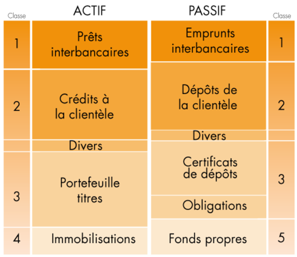

```{r setup, include=FALSE}
knitr::opts_chunk$set(
  echo = FALSE,              # Ne pas afficher le code
  fig.align = 'center',      # Centrer les images
  #out.width = "70%",         # Largeur des images
  fig.show = "hold",         # Maintenir les graphiques dans l'ordre
  fig.cap = NULL           # Pas de légende par défaut
)
# Commande git de supppression du remote : 

# git remote rm origin
```

```{=tex}

```


```{=tex}
\clearpage
\newpage
```
# Qu'est-ce qu'une banque ?

## Des origines à aujourd'hui

-   **Le troc** : échange de biens, chaîne d'échanges potentiels, absence d'épargne.
-   **Solution --\> La monnaie** :
    -   Premier système bancaire, organisation centralisée, étalonnage de valeur.
-   **Banque** : institution essentielle.
    -   Collecte l'épargne, accorde des prêts, met à disposition des moyens de paiement.

### Histoire de la banque

-   **2e millénaire av. J.-C.** : Le prêt de marchandises se fait dans les temples.
-   **VIIe siècle av. J.-C.** : Apparition de la monnaie (prêts et dépôts d'argent).
-   **Jusqu'au Moyen Âge** : Activité bancaire = opérations de caisse (dépôt et retrait).
-   **Croisades** : Augmentation des échanges --\> banques facilitent ces échanges.
-   **1511** : Première banque à Venise. Florence devient une place bancaire majeure.
-   **21e siècle** : L'État renforce son autorité sur les banques.
    -   Exemple : Roosevelt post-1929 --\> Séparation banques d'affaires et banques de dépôts.
-   **1945 en France** : Nationalisation, incluant la Banque de France.
-   **1960 et plus** : Évolution : nouveaux clients (femmes, jeunes, enfants), nouveaux moyens de paiement (cartes), diversification (industrie, immobilier, marchés financiers).

**Commentaire** : Les banques deviennent un agent indispensable au quotidien.

## Le système bancaire

### Le système français

-   **3 grandes activités** :
    -   Détail.
    -   Financement et investissement.
    -   Gestion d'actifs ou autres spécialités.
-   **Système concentré** : Beaucoup de banques-assureurs.
-   **2021** : 5 banques françaises parmi les 15 plus grandes de l'UE.

### La Banque centrale européenne (BCE)

```{r, echo=FALSE, fig.cap=c("Illustration de la BCE", "Logo de la BCE"), fig.show='hold', out.width="45%", fig.align='center'}
knitr::include_graphics(c("Images/BCE.jpg", "Images/JST_BCE.jpg"))
```

**Rôle et actions de la BCE** : Veiller à la stabilité des prix.

-   Fixation des taux d'intérêt des prêts aux banques.
-   Gestion des stocks de devises (garantie des taux).
-   Contrôle des marchés financiers et du système de paiement.
-   Garantie de la sécurité et solidité du système européen.
-   Production des billets.
-   Surveillance de l'évolution des prix.

**Cas COVID-19** : Moratoire sur les prêts, prêts garantis par l'État.

### Les produits bancaires - Focus sur le crédit

-   **Principaux produits** : Prêts et crédits et dépôts.
-   **Crédits bancaires classiques** : Court et moyen et long terme.
-   **Financements locatifs** : Crédit-bail, LOA, location financière.
-   **Engagements par signature** : Caution, garanties financières, couvertures, documentation.
-   En comptabilité : Distinction entre crédits débloqués (flux) et opérations hors bilan (engagements).

#### Les dépôts : passif de la banque

-   **Dépôts à vue** :
    -   Comptes de dépôt ou comptes chèques (réglementés).
    -   Comptes courants : Supposent des entrées et sorties régulières.
-   **Comptes épargne et livrets** :
    -   Sans retrait d'espèces ni moyen de paiement.
    -   Réglementés, fiscalisés, rémunérés (intérêts).
-   **Dépôts à terme et plans d'épargne** :
    -   Clause de non-retrait avant échéance pour garantir un rendement.
-   **Dépôts de titres** : Comptes dédiés aux valeurs mobilières.

#### Bilan simplifié de la banque

```{r, echo=FALSE, fig.cap="Bilan simplifié d'une banque universelle", out.width="50%", fig.align='center'}

```

Les banques diversifient leurs produits : fonds d'investissement, bourse, gestion de patrimoine, services B2B.

#### Le crédit

-   Souscription en ligne ou en agence.
-   Principales données : Montant, durée, taux, échéances ou mensualités, TAEG, montant total dû.

```{r, echo=FALSE, fig.cap="Amortissement de crédits",fig.align='center',out.width="85%"}
knitr::include_graphics("Images/tableau_amortissement_crédit.png")
```

-   **Depuis 2019** : Durcissement des critères pour les crédits immobiliers.

```{=tex}
\clearpage
\newpage
```
# Quels sont les risques d'une banque ?

## Les principaux risques de la banque

### Risque de crédit

-   Absence de remboursement d'un prêt.

### Risque de marché

-   Pertes issues des variations de marché.

### Risque opérationnel

-   Pertes dues à des défaillances de processus, personnel, systèmes internes ou événements extérieurs.

### Risque de liquidité

-   Incapacité à honorer ses paiements à court terme.

## Les risques secondaires

-   **Risques** : Stratégiques, réputation, climatiques, macroéconomiques, politiques, réglementaires, concurrentiels, résolution (redressement rapide), taux.

### Focus sur le risque ESG

-   Deux axes principaux :
    -   Risque physique (impact direct).
    -   Risque de transition (adaptation).

```{r, echo=FALSE, fig.cap="Réglementation des risques ESG", fig.align='center',out.width="75%"}

```

-   Autres risques : informatiques, liés à la clientèle.

```{=tex}
\clearpage
\newpage
```
# Gestion des risques

## Réglementation bancaire

-   **Comité de Bâle** : Superviseurs de 27 pays. Renforcement de la solidité du système financier mondial (exemple : ACPR et Banque de France).
-   **Mécanisme de surveillance unique (MSU)** : Supervision du système européen par la BCE.
-   **Autorité bancaire européenne (ABE)** : Amélioration du marché intérieur européen (normes techniques).
-   **Mécanisme de résolution unique (MRU)** : Élaboration des plans de résolution supervisée par la BCE.

### Réglementation applicable

-   **Règlement européen** dit CRR.
-   Lois et règlements adoptés par chaque État membre.
-   Règles administratives : institutions législatives et réglementaires.
-   Lignes directrices : Exigences de divulgation.

## Gestion dans les établissements

-   **Cadre d'appétence aux risques** : Définit les politiques et dispositifs de gestion des risques.

-   Inclut : Ensemble d'alertes et de seuils.

-   Fixe de manière optimale les risques pris par la banque pour faciliter la communication avec les organismes de tutelle.

-   **Dispositif internes** : Description de $\neq$ éléments

    -   des politiques d'engagement
    -   des procédure d'octroi de crédit
    -   des régles de déclassement et provisionnement des créances
    -   application des limites
    -   procédures d'information
    -   organisation du contrôle permanent

## Focus sur le risque de crédit :

### Principes du risque de crédit :

-   **Définition** : Risque de perte lié à l'incapacité d'un emprunteur à rembourser un prêt

-   **Maitrise du risque de crédit** --\> élaboration de la rentabilité

-   **Evaluer le risque** :

    -   Expérience et connaissance économique de la banque
    -   Outils statistiques : scores et système experts

-   **Minorer un risque** : position de couverture (garanties, assurances, provisions)

-   **Tarification du crédit** : Prise en compte du coût du risque

### L'octroi :

-   **Analyse de la demande** : situtation financière, capacité de remboursement, garanties, contexte économique, legislation (taux d'effort \<35% et durée \<25 ans pour un crédit immobilier)

### Les garanties :

-   **Garanties réelles** : Hypothèque, nantissement, gage
-   **Garanties personnelles** : Caution, avals, garanties bancaires
-   **Assurance emprunteur** : Protection en cas de décès, invalidité, chômage. Remboursement du capital restant dû à la banque.
-   **Point réglementaire** : la tarification du crédit doit prendre en compte le niveau de risque de l'emprunteur

### Mesurer le risque client :

-   Combien je porte d'engagement sur mon client ?

    -   Contrat conclu avec le client
    -   Groupe de cotation primaire : regroupement de tiers
    -   Groupe de risques : regroupement de tiers liés entre eux

-   Quel est le niveau maximun d'engagement du client ?

    -   Limite d'engagement : risque maximal que la banque peut porter sur un client ( 25% des fonds propres)

    -   Limitation sectorielle : prise en compte des risques de concentration des engagements par secteur

    -   Limite par typologie de crédit

-   Quel est le profil de risqe du client ?

    -   Sain non sensible : client peu risqué (peu d'impayés et de dépassements)
    -   Sain sensible : incidents au niveau des créances, restructuration des crédits (forbearance), incidents clients
    -   Defaut et non perfoming loans (NPL) : ne rembourse plus et ne sera plus en mesure de rembourser

\-**Caractéristiques du défaut** :

-   90 jours d'arriéré consécutifs
-   Procédure de surendettement recevable
-   Crédit restructuré en situation d'impayé
-   Attention au risque de contagion si les prêts sont liés

### Mesure du risque de crédit sur un client :

-   Incident évalué au niveau de l’Obligor, pas juste sur un contrat. Arriéré déclenché dès un incident significatif (absolu ou relatif aux encours).\
-   Calcul quotidien du statut de défaut.\
-   Période probatoire de 3 mois minimum avant retour en situation saine.\
-   Dégradation de risque = impact sur cotation, provisions, coût du risque et fonds propres.\
-   Données partagées avec Banque de France et BCE.\
-   Reconnaissance du défaut peut impacter d’autres banques via échanges d’infos banque de France et BCE.

### Principaux évenement du risque de crédit :

-   **Risque dès l’octroi du crédit** (même sans acceptation).\
-   **Incidents sur créances** : impayés ou découverts non autorisés.\
-   **Événements majeurs** : incapacité, perte d’emploi, décès.\
-   **Arriérés** : dès un incident significatif sur une créance.\
-   **Restructuration** : ajustements pour débiteur en difficulté.\
-   **Défaut** : 90 jours d’arriérés, incapacité de paiement, expertise, ou procédures (surendettement, contentieux).\
-   **Pertes** : créances irrécupérables.

### Indicateurs clés de la mesure de risque

\-**Exposition** : - encours total : Encours total bilan et hors-bilan des prêts, comptes courants débiteurs, financements accordés non encore débloqués et garanties données - taux d'encours sous surveillance : Ratio Encours sous surveillance Encours total : répartition de l'encours par entité et cote interne et secteur économique … - Top N des plus importants clients

-   **Défauts** :
    -   taux de défaut: Ratio Nombre de clients ayant été en défaut sur les 12 derniers mois / Nombre de clients sains il y a 12 mois;
    -   Montant, taux et variation des encours de CDL: par mois et trimestre et année
    -   durée moyenne en douteux : Durée moyenne d'un dossier en douteux âge moyen du stock contentieux : Délai moyen écoulé depuis l'entrée en contentieux (en mois) du stock des créances contentieuses
    -   Top N des plus importants clients en sensible, Douteux ou Contentieux.
-   **Respect des limites de crédit**:
    -   nombre de nouveaux dépassements validés en comité de crédit
    -   nombre de nouveaux dépassements liés à des dégradations de note.
-   **Incidents:**
    -   taux d'irréguliers: Ratio Encours irréguliers (montants en dépassement d'autorisation sur compte courant débiteur) et Encours des comptes courants débiteurs
    -   taux d'impayés: Ratio Impayés / Encours des prêts
    -   taux de prorogation: Ratio Encours prorogé / Encours des prêts.
-   **Garanties:**
    -   taux de couverture par des garanties: Ratio Encours (Bilan + Hbilan) des prêts avec garantie / Encours total (Bilan + Hbilan) des prêts.
-   **Provisions:**
    -   Montant provisions sur clients sains montant des provisions affectées (sur clients en défaut) 
    -   taux de provision sur douteux  et contentieux : Ratio Montant des provisions affectées et Montant en douteux ou contentieux 
    -   montant des provisions collectives 
-   **Coût du risque :**
    -   coût du risque affecté et global pertes réelles sur le trimestre.
-   **Exigences Fonds propres :**
    -   exigence en fonds propres au titre du risque de crédit.

## Synthèse : Saine gestion du risque de crédit

-   **Sélection des crédits** :
    -   Collecte d'informations sur le client et son secteur.\
    -   Définition de limites pour l'octroi selon cotation et encours.\
    -   Garantie obligatoire.
-   **Suivi des crédits** :
    -   Cotation tenant compte de la solvabilité du client.\
    -   Suivi quotidien pour gérer incidents et recouvrements.\
    -   Respect des limites d’engagement et sectorielles.\
    -   Provisionnement basé sur pertes estimées.
-   **Respect des obligations réglementaires** :
    -   Calcul du risque pondéré pour les fonds propres.\
    -   Partage de données avec Banque de France et BCE (Anacrédit).
-   **Projection et stress tests** : Évaluation de certains indicateurs de risque.

```{=tex}
\clearpage
\newpage
```
# Introducion partie 2 la Sillicon valley bank :

-   **Histoire** :
    -   Fondée en 1983 par des entrepreneurs de la Sillicon Valley.
    -   Banque commerciale spécialisée dans les start-up et les entreprises technologiques.
    -   16e banque américaine en 2020.
-   **Faillite** :
    -   Suite pandémie covid --\> levée de fonds des start up
    -   Placement des liquidités en US bonds --\> mais avec la monté des taux --\> perte de valeur des actifs
    -   Dégradation condition de financement --\> start up pioche dans leur liquidités --\> vente actif à prix faible
    -   Enregistrement d'une perte + augmentation de K --\> crainte
    -   Mouveement panique de retrait de liquidités --\> faillite
    -   Gouv US intervient pour éviter la faillite
    -   Mise en place de régles de gestion des liquidités plus strictes
-   **Quid législation USA**:
    -   Post 2008 --\> Réglementation plus stricte pour les banques
    -   Administration Trump --\> assouplissement des régles
    -   Bilan suppérieur à 250 milliards --\> "surveillance renforcée"
    -   Post faillite SVB --\> 190 banques parmis les 4700 sont en risque de faillite
-   **Contagion possible en Europe ?**
    -   Dirigeants rassurants
    -   Banques UE --\> plus diversifiées que les USA
    -   Peu de liens directs entre les banques UE et SVB
    -   Mais banques également contraintes à la baisse des taux
-   **Impact sur le Crédit Suisse** :
    -   Baisse de 2% du titre
    -   Crainte de contagion
    -   Baisse des taux --\> impact sur les marges
    -   Baisse des actifs --\> impact sur les fonds propres
        -   Refus de la saudia national bank de recapitaliser
    -   Baisse de la confiance des investisseurs --\> impact sur le cours de l'action
    -   19 mars 2023 --\> UBS rachète le Crédit Suisse pour 3 milliards de francs suisses

# Comment se couvrir contre les risques de crédit ?

## Système de notation interne

### Définitions :

-   **Notation interne** : Évaluation de la solvabilité d'un client.
    -   Cotation unique d'un client
    -   Une méthode par banque
    -   basé sur des infos internes et externes
    -   Groupe Crédit mutuel --\> règle commune
    -   Exception :
        -   Client avec Siren --\> unique au sein du CMBArkea
        -   Population grands comptes --\> unique au sein du CM
-   \*\* Le taux de défaut\*\* :

$$
\text{Taux de défaut} = \frac{\text{Nombre de clients passé au moins une fois en défaut dans l'année}}{\text{Nombre de clients sains au début de l'année}}
$$ - **Cotation :** Probabilité de défaut d'un client dans les 12 prochains mois et mesure la non capacité à assurer ses engagements - Indication sur le profil de risque --\> différenciation des clients - Pouvoir de décision lors de l'octroi de crédit - Entre dans les exigences de FP et provision de la banque

-   **Echelle de cotation :**
    -   A+, A-, B+, B- : Faible
    -   C+, C-, D+ : Moyen
    -   D-, E+ : Fort
    -   E-,F : Défaut

### Modèle au CM Arkea :

-   **Cotation automatique :**
    -   Particuliers vs Personne morales retail
    -   Entreprise individuelle vs Agriculteurs vs SCI vs Association
-   **Cotation semi-automatique :**
    -   Corporate entreprise vs Promotion immobilière
-   **Cotation manuelle :**
    -   Financement spécialisés
        -   Grands comptes
        -   Assurances
        -   Financements d'acquisitions (FA ou FE)
        -   Foncières (FO)
        -   Banques
        -   Souverains

### Grille unique Arkea :

-   **Deux calibrages sont retenus :**
    -   Echelle spécifique au marché des particuliers
    -   Echelle unique pour le reste
        -   Un même taux de défaut = même note restituée à l'exploitant
-   **Deux échelles supplémentaires (acté spécialisée) :**
    -   Souverains (méthode standard)
    -   Banques/Grands comptes et assimilés : correspondaance avec les notations externes

### Système de notation :

-   **Définition du processus de notation :**
    -   Cotation interne
        -   Mesure de la proba de défaut à horizon 1 ans
        -   Réactive --\> car plus près du fonctionnent des comptes de la banque
    -   Cotation BDF :
        -   Associée à la prob défaut entreprise, horizon 3 ans
        -   Plus stable --\> car plus liée à la situation économique

### Le processus de cotation d'un client :

#### Cotation quotidienne et mensuelle :

-   **Traitements mensuels :**
    -   Affectation : choix du modèle en fonction du type de client
    -   Cotation primaire : cotation à l'aide des variables client
-   **Traitements quotidiens :**
    -   Cotation risquée : prise en compte des évenements risques
    -   Cotation influencée groupe : relation sur les cotations groupes foyer ou SIREN
    -   Cotation ajustée : Ajustement par un processus dérogatoire manuel

La somme de ces éléments constitue la cotation finale du client.

#### Affectation aux algorithmes :

-   **Affectation au niveau GCP :** groupe foyer ou groupe SIREN

    -   Permet de découper l'ensemble de la population ARKEA
        -   Sélection par type de GCP
        -   Sélection par axe de marché (code juridique client)
        -   Sélection par catégorie d'exposition (retail vs corporate)
        -   Existence ou non d'une note nationale ou grille experts

-   **L'affectation dans les faits :**

    -   Affectation des GCP en fonction de ces critères et de l'ordre de priorité
        -   Algorithme experts non modélisable
        -   Algorithmes statistiques basé des variables (comportement/risque)
    -   Les modèles sont homologués par la BCE

#### Modélisation de la cotation primaire

-   **1) Constitution d'une base de données :**
    -   Saine + obs du défaut sur un an
-   **2) Segmentation de la population :**
    -   Sous-population homogène
-   **3) Modélisation :**
    -   Sélection variables discriminantes / performances / découpage en sous cotation

```{r, echo=FALSE, fig.cap="Segmentation de l'algorithme des particuliers" ,fig.align='center',out.width="85%"}

```

#### Application de la cotation primaire :

-   **1) Cotation primaire :**
    -   Associée à un groupe de cotation primaire (CGP)
    -   Calculée quotidiennement
    -   Issue d'un processus automatique de cotation
-   **2) Les données de l'algo statistiques**
    -   Data du fonctionnement interne
    -   Data signalétiques : sexe, age ...
    -   Data financières

#### Cotation risquée :

-   **1) Méthodologie :**
    -   Calculée quotidiennement
    -   Obtenue par application de la matrice des risques
    -   Dégradante pour l'ensemble des tiers CGP ?
        -   Si un seul des tiers est dégradé --\> l'ensemble des tiers le sont
    -   Différentes données :
        -   interne : impayés, incidents, découverts, rejets
        -   externe : cotation banque de France
        -   Saisie manuelle
    -   Différenciation en fonction du type de portefeuille
        -   Matrice particulier / Corporate entreprise / Personnes morale retaiil ou SCI ou OBNL(organisme à but non lucratif)

#### Cotation influencée :

-   **1)Définition et objectif :**
    -   Prise en compte de la cotation groupe dans la cotation client
    -   Obtenue par croisement de trois scores :
        -   Cotations primaires des tiers du groupe / pondéré au % de détention
        -   Score issu du bilan consolidé du groupe
        -   Score issu de données qualitatives
        -   " Ajustement possible selon le profil de risque"

```{r, echo=FALSE, fig.cap="Segmentation de l'algorithme des particuliers" ,fig.align='center',out.width="80%"}

```

#### Cotation ajustée et cotation finale :

-   **Ajustement de la cotation :**
    -   A la hausse --\> limite 3 cran
    -   A la baisse --\> pas de limite
-   **Autorisé :**
    -   Aux personnes sous habilitation et soumise à un contrôle
    -   Possible que sur les cotations saines
    -   Avec une date de validité associée à la cotation
-   **Cotation finale :** Résultante de l'ensemble des traitements
    -   Cotation primaire + risquée + influencée + ajustée
    -   Rafraichissement quotidien
    -   Diffusé à l'ensemble des systèmes de la banque

#### Utilisation de la cotation finale :

-   **1) Utilisation :**
    -   Décision d'octroi de crédit
        -   Tarrification + délégation du pouvoir
    -   Suivi du risque de crédit
    -   Appréciation de la qualité globale du portefeuille
    -   Respect des limites d'engagement
    -   Calcul des provisions et exigences de fonds propres (EFP)

## Focus sur la modélisation d'un algorithme de cotation :

### Construction des données :

#### Périmètres données utilisées :

-   **Données internes :**
    -   Historique des comptes/ épargne / crédit / données financières / risques
    -   Donnée historisée trimestriellement par tous les SI

#### Constitution de la base de données :

-   Période d'obs par défaut --\> un an
-   BDD commune sur l'ens du gp bancaire
-   BDD test et BDD d'entrainement

#### Périmètre - Variables cibles à modéliser

-   Modélisation du défaut Balois
-   Base composée de clients sains en début de période
-   La variable cible est calculée sur les 12 mois suivants

### Construction d'un score :

-   **1) Préparation des données :**
    -   QDD / Nouvelles variables / Segmentation homogène
-   **2) Sélection des variable**
    -   Discrétisation des variables continues
    -   Regroupement de modalités
    -   Sélection variables candidates (corrélations, VIF, ACP, robustesse)
-   **3) Construction + validation modèle :**
    -   Train et test base
    -   Modélisation logistique
    -   Sélection 1 ou pls modèles
    -   Estimation coef (courbe ROC / AUC)
    -   Constitution des classes de risques
        -   Affectation de la cotation primaire à partir d'une échelle de cotation
    -   Mesure de performance sur les échantillons

```{r echo=FALSE, fig.cap="Recap modelisation" ,fig.align='center',out.width="70%"}

```

### Processus d'homologation :

-   **Utilisation des méthodes internes** pour le calcul de l’exigence en fonds propres nécessite une homologation par la BCE ou l'ACPR.\
-   **Étapes au niveau de l’établissement** :
    -   Construction des modèles.\
    -   Validation par les instances internes de pilotage projet (GT, CPIL).\
    -   Audit interne de Contrôle Permanent des modèles.\
    -   Utilisation des modèles pendant une période suffisante et règlementaire (**use-tests**).\
    -   Audit interne de pré-homologation donnant lieu à un rapport.\
    -   Demande officielle et normée de l’établissement pour être audité.

#### Exemple le backtest :

-   **Objectif** : Tester la fiabilité d’un modèle en utilisant des données historiques.\
-   **Méthode** :
    -   Comparer les prévisions du modèle aux résultats historiques réels.\
    -   Analyser les écarts pour mesurer la précision et identifier les faiblesses.\
-   **Avantages** :
    -   Validation du modèle avant déploiement.\
    -   Amélioration continue et conformité réglementaire.\
-   **Limites** :
    -   Dépendance aux données passées.\
    -   Risque de sur-ajustement (**overfitting**).\
    -   Difficulté à intégrer des événements rares.

### Sujet connexes au SNI et au SI :

### Synthèse en bullet points :

SNI : Système de Notation Interne.
SI : Système d’Information.

-   **Le SNI** dépasse le calcul d’une cotation et s’intègre dans :
    -   Les outils, processus métiers et activités de la banque.
-   **Évolutions transverses du SI** :
    -   Modalités de gestion du défaut.\
    -   Règles et traitements de constitution des groupes.
-   **Appropriation du dispositif par les exploitants** :
    -   Formations.\
    -   Outil dédié à la restitution, affichage et explication des cotations.\
    -   Restitution des cotations dans les documents majeurs.
-   **Exploitation de la cotation dans les outils et process métiers** :
    -   Instruction crédit / Calcul et gestion des garanties.\
    -   Gestion des limites et calcul des pouvoirs.
-   **Supervision** :
    -   Qualité des données.
-   **Conclusion** :
    -   Une grande partie de l’activité bancaire repose sur un **SI performant, sécurisé et homologué**.

## Les paramètres :

**1) Objectif :**  - Post catégorisation des clients --\> estimation des pertes potentielles - Paramètres principaux : - Probabilité de défaut (PD) - Coefficient de conversion de crédit (CCF) - Parts des engagements hors bilan convertis au bilan en cas de défaut - Perte en cas de défaut (LGD) : - Estimation des pertes en cas de défaut - Coexistence des paramètres :

### La probabilité de défaut :

-   **Définition** : Probabilité qu'un client ne puisse pas honorer ses engagements.
-   **Calcul** : Détermination annuelle à partir de l'historique de taux de défaut 1 an

$$
\text{Taux de défaut} = \frac{\text{Nombre de clients passé au moins une fois en défaut dans l'année}}{\text{Nombre de clients sains au début de l'année}}
$$ $$
\text{PD finale} = \text{PD historique} + \text{Marge de prudence liée à la volatilité temporelle} + \\ 
\text{Marge de prudence liée à la volatilité sectorielle et géographique} + \text{Marge de prudence liée à la qualité des données}
$$

### Le coeffiicient de conversion de crédit :

-   **Définition** : Part des engagements hors bilan convertis au bilan en cas de défaut.

$$
\text{CCF} = \frac{\sum_{Contrats} \text{Solde bilan hors défaut } - \sum_{contrats} \text{soldes bilan début période} }{\sum_{Contrats} \text{soldes HB début de période}}
$$

```{r echo=FALSE, fig.cap="Exemple prêt habitat CCF" ,fig.align='center',out.width="70%"}


```

### La perte en cas de défaut :

-   **Définition** : Estimation des pertes en cas de défaut.
    -   Rapport entre la perte subie sur une expo en cas de défaut et le montant de l'expo au moment du défaut
    -   Des marges de prudences sont ajoutées à la LGD historique pour tenir compte des incertitudes

$$
\text{LGD} = 1- \frac{\sum \text{Récupérations actualisée}}{\text{Solde au défaut}}
$$

```{r echo=FALSE, fig.cap="Exemple prêt habitat LGD" ,fig.align='center',out.width="70%"}


```

### Paramètres Backset :

-   **Définition** : -Estimation approfondie de la qualité des estimations (LGD, PD, CCF, EL Best)

-   **Objectif** :

    -   Proposer des amélioration du modèle

-   **4 Thèmes identique à chaque paramètres** :

    -   Analyse de la représentativité des données
    -   Analyse de la stabilité des paramètres
    -   Analyse de la performance des paramètres
    -   Contrôle du niveau de conservatisme des paramètres

## Nouveauté IRB Repair :

-   **Définition :**
    -   Processus de remédiation ou d'amélioration d'un modèle interne
    -   On peut définir la nouvelle probabilité de défaut comme ci-dessous :

$$ 
PD = TD_{LRA} + Marge_{TD} + Marge_{Volatilité} + Marge_{QDD} + Marge_{NDOD}
$$

-   **LRA: Moyenne de long terme :**
    -   Le calcul de la LRA doit systématiquement être basé sur le calcul d'une moyenne à LT des taux de défaut un an.

$$ 
TD_{LRA} = \frac{1}{nb années} \frac{\sum_{i=1}^{nb années} TD_{i}}{nb années}
$$

-   **Calcul d'une marge TD** : (Taux de défaut)
    -   Calcul d'un IC de Clopper à 95% sur chaque TD annuel obs
    -   Plus le nb emprunteur est elevé plus la marge est faible

$$
Marge_{TD} = \frac{1}{nb années} \sum_{i=1}^{nb années} BorneSup_{i} - TD_{LRA}
$$

-   **Calcul d'une marge de volatilité :**
    -   Calcul de l'écart type de l'IC des TD annuels
    -   Avec une profondeur d'historique de 14 années le coef déflation est de 058. Le coef diminue à mesure que la profondeur historique augmente.

$$
Marge_{Volatilité} =  \frac{t_{95\%}\times(Nb_{années}-1)}{\sqrt{Nb_{années}}} \times \sigma(BorneSup)
$$

-   **Quantification de la marge QDD** :Qualité de la données

    -   La marge est quantifiée au **niveau segment de PD** grâce à un système de **pondération**.\
    -   La différence entre **TD valeurs manquantes** et **TD autres modalités** est répartie en fonction :
        -   Du **pourcentage de valeurs manquantes**.\
        -   Du **poids du segment de cotation** dans l’algorithme.\
        -   Du **poids de l’algorithme** dans le segment de PD.\
    -   La marge est ensuite distribuée **par cotation** selon le **nombre de défauts**.

-   **Quantification de la marge NDOD** : Niveau de détail des données

    -   **Objectif** : S’assurer que l’estimation de la **PD** reste conservatrice avec la **nouvelle définition du défaut**.\
    -   **Mécanisme** :
        -   Si les **TD anciens** sont inférieurs aux **TD nouveaux**, l’estimation de la PD est ajustée pour s’aligner sur les nouvelles données.\
        -   La marge est évaluée au **niveau CHR** (segment PD x cotation).\
    -   **Données utilisées** :
        -   **TD à horizon 6 mois** calculés semestriellement de décembre 2009 à décembre 2020.\
        -   Le point de **juin 2019** est exclu car il marque la **transition** entre ancien et nouveau défaut.\
    -   **Méthodologie** :
        -   Utilisation d’une **régression logistique** pour tester la significativité des écarts entre **anciens et nouveaux TD**.\
        -   Si applicable, la marge (basée sur TD 6 mois) est **calibrée sur TD 1 an**.

-   **LGD et CCF en nombre** :

    -   LGD -\> Perte en cas de défaut
    -   CCF -\> Part des engagements hors bilan convertis au bilan en cas de défaut

$$
LGDC_{contrat} = 1 - \frac{\sum_{i=1}^{nb défauts} \text{Récupération actualisée}}{\text{Encurs au déclassement}}
$$

```{r echo=FALSE, fig.cap="Schéma LGD" ,fig.align='center',out.width="70%"}


```

# Les provisions :

Comment se protéger contre les risques de crédit ?

-   Perte attendues : Directement impactées dans le résultat via les provisions

-   Pertes inattendues : couverte par les exigences en fonds propres jusqu'à 99.9% de probabilité.

## IFRS 9 :

### Contexte :

-   **Constat :**
    -   La crise de 2007/2008 révèle les limites de la norme **IAS 39** (provisionnement des seules pertes avérées, tardif et insuffisant).
-   **Recommandations G20/FSB (2009) :**
    -   Adopter un modèle anticipatif des **pertes de crédit attendues (ECL)** basé sur des données **prospectives**.\
    -   Prévoir des dispositifs **contra-cycliques** (coussins prudentiels).
-   **Norme IFRS 9 :**
    -   Publiée le **24 juillet 2014** par l’**IASB**.\
    -   Remplace **IAS 39**, introduisant le modèle de **pertes attendues**.\
    -   Applicable dès le **1er janvier 2018** (uniquement pour les **comptes IFRS**).

### Présentation de la norme :

### IFRS 9 : Qu’est-ce que c’est ?

-   **IFRS** = **International Financial Reporting Standards**\
    Norme comptable réglementaire pour les **instruments financiers**, régissant la présentation des données comptables au niveau international.

### Évolutions apportées par IFRS 9 :

-   **Modèle de classement et d’évaluation des actifs et passifs financiers**
    -   Révision des critères de classification (en fonction du modèle économique et des caractéristiques des flux de trésorerie).
-   **Modèle prospectif de dépréciation**
    -   Introduction des **pertes attendues (ECL)**, remplaçant les pertes constatées, pour une estimation plus proactive des dépréciations.
-   **Réforme de la comptabilité de couverture**
    -   Modifications apportées pour aligner davantage la comptabilité de couverture avec la gestion des risques.
-   **Phase 1 :** Classification et évaluation des actifs et passifs financiers.
    -   Trois catégorie et deux axes décisionnels

```{r echo=FALSE, fig.cap="Classification et évaluation des actifs et passifs financiers" ,fig.align='center',out.width="80%"}


```

-   **Phase 2 :** Dépréciation des actifs financiers.
    -   Modèle de dépréciation des actifs financiers basé sur les pertes attendues (ECL).
    -   Déterminer la méthodologie de provisionnement des actifs financiers
    -   Définir les paramètres du modèle
    -   Simuler les montants de provisions
    -   Application du modèle à tous les actifs pouvant être dépréciés
    -   Différence entre IAS39 et IFRS9
        -   IAS 39 : Pertes avérées
        -   IFRS 9 : Pertes attendues (dès l'octroi du crédit)

```{r echo=FALSE, fig.cap="Dépréciation des actifs financiers" ,fig.align='center',out.width="80%"}


```

### Dépréciation : instauration d'un nouveau modèle

```{r echo=FALSE, fig.cap="Dépréciation des actifs financiers, instauration d'un nouveau modèle" ,fig.align='center',out.width="80%"}


```

### Dépréciation – Affectation aux Buckets

-   **Classement des actifs financiers en 3 catégories :**
    -   **Bucket 1** : Créances saines, risque de crédit faible ou stable.
    -   **Bucket 2** : Créances saines, risque de crédit dégradé depuis l’octroi.\
    -   **Bucket 3** : Créances en défaut.
-   **Affectation aux buckets et calcul des provisions :**
    -   Au niveau du **contrat**, un même client peut avoir des contrats dans différents buckets (selon la date d’octroi).\
    -   **Pas de définition précise** de la dégradation significative ; chaque établissement définit ses propres critères.
-   **Critères d’affectation au Bucket 2 :**
    -   **Critères absolus** : restructuration, impayés \> 30 jours, octroi en défaut.\
    -   **Critère relatif** : Dégradation significative du risque de crédit depuis l’octroi.
-   **Affectation des paramètres IFRS 9 à chaque contrat selon :**
    -   La **cotation** du client.
    -   Le **type de contrepartie**.
    -   Le **type de produit/garantie**.
-   **Calcul des ECL selon une formule réglementaire pour chaque contrat et selon le bucket :**

$$
EAD = \text{Bilan + Hors-Bilan} \times CCF
$$

```{r echo=FALSE, fig.cap="Dépréciation des actifs financiers, instauration d'un nouveau modèle" ,fig.align='center',out.width="80%"}


```

### Calcul des ECL (Expected Credit Losses) par Bucket

-   **Bucket 1 :**
    -   **Horizon de calcul des ECL** : 1 an.\
    -   **PD** (probabilité de défaut) : Calculée sur 1 an.
-   **Bucket 2 :**
    -   **Horizon de calcul des ECL** : Jusqu'à la **maturité** du contrat.\
    -   **PD** : Calculée sur toute la durée du contrat, nécessitant une estimation des pertes pour chaque échéance.
-   **Formule de calcul des ECL :**
    -   Paramètres constants (à l’exception de la **PD**).

$$ ECL = EAD \times PD \times LGD $$ - **Forward-Looking :**\
- Les paramètres de **PD** intègrent une anticipation des **effets macro-économiques** et **idiosyncratiques** (spécifiques à l'entité).

### Provisions CNC Bucket 3 :

### Provisionnement des encours en défaut (Bucket 3)

-   **Encours en défaut** : Enregistrés dans le **Bucket 3**.
-   **Calcul des provisions** : Basé sur des **taux statistiques** ou **estimations d'expert**.
-   **Principes** :
    -   Taux de provision croissant avec l’ancienneté du défaut.\
    -   **Provisionnement uniforme** entre bilan et hors-bilan (modulo CCF).\
    -   **Provisionnement des intérêts** : à **100%**.\
    -   **Priorité au provisionnement manuel** (expert) par rapport aux grilles statistiques.
-   **Distinction des populations** :
    -   **HDP** : **Algorithmes de cotation de masse**.\
    -   **LDP** : **Grilles expertes**.

### Coût du risque :

-   **Définition :**
    -   Il est remis à 0 chaque année et impact le résultat groupe

$$ 
\text{Coût du risque} =  \text{Dotation de provision} - \text{Reprise de provision} + \\ \text{Pertes non couvertes} - \text{Récupérations de créances amorties}
$$

## Les exigences en fonds propres :

### Réglementation prudentielle :

#### Introduction :

-   **Comité de Bâle** : Créé en 1974 pour renforcer la solidité du système financier mondial et améliorer le contrôle prudentiel.
-   **Membres** : Superviseurs de **27 pays**, dont la France.
-   **Concordat de Bâle (1975)** : Introduit le contrôle bancaire sur une base consolidée.
-   **BCBS** : Basel Committee on Banking Supervision (Comité de Bâle sur le contrôle bancaire).

#### Bâle I (1988)

-   **Faiblesses et lacunes** :
    -   Focalisation excessive sur les **fonds propres** au détriment du **risque**.\
    -   Approche trop **simpliste** du risque par rapport à la réalité.\
    -   **Absence de prise en compte** des nouvelles techniques de couverture des risques.\
    -   **Non prise en compte** du **risque opérationnel**.\
    -   Les **formules standard** "taille unique" ne favorisaient pas l’adoption de **bonnes pratiques** de gestion du risque.

### Bâle II (2004)

-   **Bâle II (2004)** : Accords visant à une couverture plus exhaustive des règles bancaires.
-   **Comité de Bâle** : Recommandations sans force de loi, avec 4 textes publiés entre juin 2004 et novembre 2005.
-   **Union Européenne** : Directive européenne **CRD** (Capital Requirement Directive) adoptée en octobre 2005, obligatoire pour tous les pays membres.
-   **France** : Transposition en droit français via un arrêté du **20 février 2007**, amendé plusieurs fois jusqu'en 2011.

### Règlementation Bâle III

-   **Actes législatifs** :
    -   **CRD IV** : Directive 2013/36/UE (accès et surveillance des établissements de crédit) et **CRR** : Règlement (UE) n° 575/2013 (exigences prudentielles).
    -   **Bâle III** : Règlement européen, sans transposition en droit français.
-   **Actes délégués** :
    -   **NTR (Normes techniques de réglementation)** : 50 normes prévues, 28 adoptées au 12 septembre 2016.
-   **Actes d'exécution** :
    -   **NTE (Normes techniques d’exécution)** : 31 normes prévues, 25 adoptées au 29 septembre 2016.
-   **Bâle IV** : Prévu pour finalisation en **2025**, ou finalisation de Bâle III.

#### Le comité de BALE :

- Objectifs de Bâle II (conservés en Bâle III)

-   **Mesurer la qualité de l'emprunteur**.
-   **Réduire l'écart** entre vision réglementaire et économique du risque.

- Dispositif au niveau bancaire

-   **Système de notation interne** pour chaque client.
-   **Évaluation interne** des paramètres de risque.
-   **Calcul trimestriel** de l'exigence en fonds propres basé sur une nouvelle mesure du risque.

[Citation :]{.underline}

Bale II/III est une évolution de la réglementation dont le fondement est d’autoriser les Banques à *« utiliser leurs propres mesures du risque de crédit comme données de base dans le calcul du capital nécessaire à leur activité, sous certaines conditions et avec l’accord explicite des autorités de régulation »*


#### Contexte financier et Bâle III

- **Crise financière 2008** : Faillite de Lehman, crise des subprimes.
- **Bâle III** : Publié en décembre 2010, durcissement de l'approche en solvabilité et introduction de la liquidité.
- **Juillet 2011** : Publication du projet de règlement **CRR** (applicable directement) et de la directive **CRD IV** (transposition nécessaire en droit national).
- **Publication officielle** : 27 juin 2013, **CRR** et **CRD IV** applicables dès le 1er janvier 2014 avec exceptions.


- **Les ratios : ** 

--> NSFR : Net stable funding ratio = stabilité de financement 

$$\text{Solvabilité} = \frac{\text{Fonds Propres}}{\text{Exigences en fonds propres}}$$
$$
\text{Ratio de levier} = \frac{\text{Fonds propres tiers 1}}{\text{Encours comptable des actifs}}
$$


$$ \text{LCR} = \frac{\text{Actifs liquides}}{\text{Sorties nettes de trèsorerie à 30 jours}} $$

$$\text{NSFR} = \frac{\text{Ressources à plus d'un an}}{\text{Emplois à plus d'un an}} $$


#### Zoom sur LCR : 

- **1) Principe : **
  - Sortie nette de trésorerie à 30j doivent être couverte en situation de stress par un stock d'actif liquide : décaissement - encaissement 
  
$$ 
\frac{\text{Stock actifs liquides}}{\text{Sortie de liquidité nette sur 30j}} >= 1
$$ 
  
- **2) Actif liquide : **
  - Monnaies, billets, liquidité déposé en Banque centrale 
  - Actif cessible de qualité de crédit niveau 1 ou 2

- **3) Sortie nette de trésorerie à 30 jours : **
  - Sorties nettes de trésorerie : **Décaissements – Encaissements**.
  - **Encaissements ≤ 75% des décaissements**.
  - **Principaux encaissements** :  
    - **Crédits clientèle** (pondération 50% en raison du renouvellement partiel).  
    - **Remboursements entre banques** (pondération 100% en période de crise).

- **4) Principaux décaissements (= sorties de cash)** 
  - Retraits des clients (hypothèses de fuite des dépôts fixées par le régulateur) 
  - Remboursements des emprunts auprès des autres établissements 
  - Décaissements prévisionnels sur les engagements de hors-bilan
  
- **5) Les dépôts des clients ont des taux de fuite différents : **
  
  - Selon le type de clientèle (retail/corporate)
  - Selon le type de dépôts (stables 5% / moins stables - 10% / non stables au moins 10%) pour le retail
  - Selon l’existence ou non d’une relation opérationnelle pour les dépôts corporates

- **6) Dépôts stables :**

  - **Retail** :  
    - Couvert par un système de garantie des dépôts (directive 94/19/CE).
    - Fait partie d’une relation suivie, rendant le retrait improbable (ex : compte courant avec versement régulier des salaires).
    - **Identification** : Basée sur la notion de **compte courant** et l'intensité de la relation commerciale.
  
  - **Corporate** :  
    - **Relation opérationnelle** : Le client ne peut retirer son dépôt en moins de 30 jours sans compromettre son fonctionnement opérationnel.
    - **Identification** : Basée sur le type de dépôts et une comparaison entre les **dépôts à terme** et les **flux débiteurs**.
    
#### Zoom sur NSFR : 

- **1) Principe : ** 
  - Stabilité de financement, les RS > 1 an doivent couvrir les ES > 1 an 

- **2) Ressources stables :**
  - Dépôts de la clientèle / Dettes subordonnées / Emprunts obligataires / Emprunts interbancaires / Fonds propres

- **3) Emplois stables :**
  - Crédits à la clientèle / Investissements / Engagements de financement / Engagements de hors-bilan
  

$$ 
\frac{\text{Ressources stables} > 1 an}{ \text{Emplois stables} > 1 an} > 1
$$
  


------------------------------------------------------------------------

### Calcul des EFP et ratios de solvabilité : 

#### Exigences réglementaires et piliers :

```{r echo=FALSE, fig.cap="Piliers 123 " ,fig.align='center',out.width="70%"}

knitr::include_graphics("Images/piliers123.jpg")


```


#### Risque pondérés et ratio de solvabilité :


1. **Risque de crédit**  
   - Risque qu’un débiteur ne rembourse pas son crédit.  
   - Chaque créance est pondérée selon la qualité du débiteur et du crédit via un **%RWA** (*Risk Weighted Asset*).  

2. **Exigence de fonds propres (EFP)**  
   - Les fonds propres servent de **coussin de sécurité** contre les pertes non anticipées.  
   - L’EFP limite les risques pris par les banques pour assurer leur stabilité financière.  

3. **Ratio de solvabilité**  
   - Rapport entre les **fonds propres** et le **RWA** des crédits pondérés.  
   - Mesure clé pour évaluer la **solidité financière** et respecter la régulation bancaire.  


#### Risque pondérés méthode de calcul : 

- **1) Affectation des paramètres Balois à chaque contrat selon : **
  - La cotation de l'algorithme, le type de contrepartie, le type de produit/garantie

- **2) Attribution des paramètres PD, LGD et CCF à tous les contrats**
  - Il en résulte une disparité des % de RWA. 

```{r echo=FALSE, fig.cap="Risque pondérés" ,fig.align='center',out.width="70%"}


```


#### Risques pondérés calculs sous encours sains : 

$$
RWA = EAD \times \% \text{RWA} \\ 
EAD = \text{Bilan} + \text{Hors-Bilan} \times CCF \\ 
RWA \in [0,1250\%] \text{ : pour les crédits sains} \\
$$

```{r echo=FALSE, fig.cap="Formule mathématiques"  ,fig.align='center',out.width="50%"}


```


#### Risques pondérés calculs sous encours en défaut : 

- **1) Affectation des paramètres Balois à chaque contrat selon : **
  - La cotation de l'algorithme, le type de contrepartie, le type de produit/garantie
  
- **2) Introduction du paramètre EL best et pris en compte de l'ancienneté contrat**

```{r echo=FALSE, fig.cap="Risque pondérés défaut" ,fig.align='center',out.width="70%"}

knitr::include_graphics("Images/défaut.jpg")

```


**- 3) Calcul du RWA selon une formule réglementaire pour chaque contrat : **

Plus un contrat est ancien dans le défaut :

  - L’estimation de la perte finale devient plus précise.
  - Les provisions couvrent mieux cette perte.
  - Le %RWA diminue avec l’ancienneté croissante du contrat


#### Ratios : 


**1) Ratio de solvabilité : **

$$
Ratio = \frac{\text{Fonds Propres réglementaires} - (\text{Expected loss  - Provisions})}{\text{RWA Rd marché + RWA crédit + RWA opérationnel}}
$$
- Fonds propres de niveau 1

  -   Plus sécurisés mais aussi plus contraignants pour les banques.
  - Incluent un coussin de conservation applicable à toutes les banques pour préserver les fonds propres.

- Exigences de fonds propres (EFP)
    - Pilier 1 :
       - Réglementaires et identiques pour tous les établissements.
    - Pilier 2 :
      -  Exigences supplémentaires déterminées par le régulateur en fonction des risques spécifiques de chaque établissement

**2) Ratio de levier : **


- Le **ratio est simple à calculer** car il prend uniquement en compte :  
   - **Encours Bilan** et **Hors-Bilan** au dénominateur.  

- **Exemptions** permettant de réduire le dénominateur :  
   - Intra-groupes  
   - Placements auprès de la **CdC** (Caisse des Dépôts et Consignations).  


#### Comparaison des méthodes : 

- Comparaison possibles des modalités de calcul des pertes attendues 

```{r echo=FALSE, fig.cap="Comparaison des méthodes" ,fig.align='center',out.width="70%"}

knitr::include_graphics("Images/comparaison_modèle.jpg")

```


#### Rapprochement : monde comptable vs monde prudentiel : 

- **Nouvelle réglementation CRR 2** (entrée en vigueur : **juin 2021**) :  
   - Comparaison des **provisions comptables** et des **backstops** sur les **contrats en défaut**.  

- **Publication BCE** (août 2019) :  
   - Évolutions sur le traitement des **NPE** (*Non-Performing Exposures*).  
   - **Convergence** des règles de l'**Addendum BCE** avec le **CRR** pour :  
      - **Aligner les exigences** réglementaires.  
      - **Éviter les chevauchements** dans leur champ d’application.  
    

```{r echo=FALSE, fig.cap="Rapprochement prudentiel vs comptable" ,fig.align='center',out.width="70%"}


```

- Les **provisions comptables** sont **estimées et comptabilisées** pour l’ensemble des **NPE** (*Non-Performing Exposures*).  
- De nouvelles **provisions prudentielles** viennent en **complément** des premières.  
   - Elles **n’ont pas d’impact comptable** mais interviennent dans le calcul des **ratios de solvabilité**.  
   - Si le **niveau de provisionnement prudentiel** attendu n’est **pas couvert** par les provisions comptables :  
      - L’**écart** vient **diminuer les fonds propres de catégorie 1** dans le calcul du **ratio CET1**.  
- Le calcul est effectué **contrat par contrat**, contrairement aux **EL-Provisions**.  

```{r echo=FALSE, fig.cap="Rapprochement prudentiel vs comptable" ,fig.align='center',out.width="70%"}


```


#### Impacts financiers du risque de crédit : 


```{r echo=FALSE, fig.cap="Impacts financiers" ,fig.align='center',out.width="70%"}


```


#### Synthèse gestion du risque de crédit : 

```{r echo=FALSE, fig.cap="Synthèse" ,fig.align='center',out.width="70%"}

knitr::include_graphics("Images/Synthèse.png")
```


## Focus pilier 2 :

### Qu'est ce que le SREP : 

- Les **contrôleurs bancaires** évaluent régulièrement les risques des banques via le **SREP** (*Supervisory Review and Evaluation Process*).  
- Le SREP :  
   - Synthétise les **constats annuels** des autorités prudentielles.  
   - **Impose des améliorations** aux banques.  
   - Évalue leur situation face aux **exigences de fonds propres** et leur **gestion des risques**.  
   - Fixe des **objectifs clés** pour résoudre les problèmes identifiés.  
- Le SREP analyse le **profil de risque** des banques sous **quatre angles** :  
   1. **Modèle d’activité** :  
      - Évalue la **soutenabilité** de la structure et la **diversité** des activités.  
   2. **Gouvernance et gestion des risques** :  
      - Analyse la **structure organisationnelle** et vérifie la **gestion des risques**.  
   3. **Risque sur le capital** (*basé sur l’ICAAP*) :  
      - Évalue les **capitaux disponibles** pour absorber les pertes (ex. : cyberattaques, baisse des cours, défauts de remboursement).  
   4. **Risque de liquidité et de financement** :  
      - Vérifie la capacité à répondre à des **besoins de liquidité** en période de crise (ex. : retraits massifs d’espèces).  
      

```{r echo=FALSE, fig.cap="SREP" ,fig.align='center',out.width="50%"}


```

  
- Le **SREP** est mis en œuvre par les **Joint Supervisory Teams (JST)** de manière **continue**, avec une **décision SREP annuelle** remise à chaque banque.  
- Chaque banque reçoit une **lettre** précisant les **mesures spécifiques** à appliquer pour l’année suivante.  

### Déroulement du SREP :  
1. **Décisions adaptées** :  
   - Les exigences varient selon le **profil** de chaque banque.  
   - Toutes les banques doivent respecter le **Pilier I** (exigence minimale de capital).  
   - Le **Pilier 2** permet d'imposer des **capitaux supplémentaires** ou des **exigences qualitatives** (gouvernance, gestion des risques).  

2. **Suivi continu** :  
   - Les décisions SREP alimentent la **planification stratégique** et influencent la **fréquence** et l'**intensité** des activités de surveillance (audits sur place ou sur pièces).  

### Implications pour les banques :  
- Chaque banque est évaluée selon une **méthodologie commune**, adaptée à :  
   - Son **impact potentiel** sur le système financier.  
   - Son **niveau de risque** et son **statut** (entité mère, filiale, indépendante).  

- **Mesures possibles** :  
   - Augmentation des **capitaux** requis.  
   - Cession de **portefeuilles de prêts** pour réduire les risques.  
   - **Remplacement des dirigeants** ou ajustement de la **stratégie commerciale** dans les cas extrêmes. 
   

### L'ICAP: 

**L’ICAAP** est un exercice **annuel d’auto-évaluation** visant à vérifier que les **fonds propres** d’une banque sont adéquats pour couvrir son **profil de risque**.

### Exigences :  
- **Horizon minimal** : 3 ans.  
- **Deux volets obligatoires** :  
   - **Trajectoire économique**.  
   - **Scénario adverse (stressé)**.  

### Objectif :  
L’ICAAP produit un **rapport annuel** destiné aux **organes dirigeants** et aux **autorités de supervision**.

### Les **7 principes** (Guide BCE) :  
1. **Responsabilité** : L’organe de direction assure une gouvernance saine de l’ICAAP.  
2. **Intégration** : L’ICAAP fait partie intégrante du cadre global de gestion.  
3. **Continuité des activités** : L’ICAAP garantit l’adéquation des fonds propres pour assurer la pérennité de la banque.  
4. **Identification des risques** : Tous les risques significatifs sont recensés et inclus.  
5. **Capital interne** : Le capital est de haute qualité et bien défini.  
6. **Quantification des risques** : Les méthodologies appliquées sont appropriées, cohérentes et validées indépendamment.  
7. **Tests de résistance** : Des tests réguliers garantissent l’adéquation des fonds propres face à des conditions défavorables.  


```{r echo=FALSE, fig.cap="ICAAP" ,fig.align='center',out.width="75%", }

```

\newpage

## Exemple de risque de couveture de crédits :

### Catégorie A : Administration centrale 

- Population en STD / faible risque : 

```{r echo=FALSE, fig.cap="Catégorie A" ,fig.align='center',out.width="70%"}


```


### Catégorie B : Banque de détail

- Population méthode interne / diversité de produit 

```{r echo=FALSE, fig.cap="Catégorie B" ,fig.align='center',out.width="70%"}


```

\vspace{7cm}

### Catégorie C : Corporate 

- Population en méthode interne / Importance de la gestion individualisée 

```{r echo=FALSE, fig.cap="Catégorie C" ,fig.align='center',out.width="70%"}


```


### Catégorie D : Retail/Detail 

- Population en méthode interne / PTF de masse 

```{r echo=FALSE, fig.cap="Catégorie D" ,fig.align='center',out.width="70%"}


```


### Exemple autres catégories : 

- E : Equity et actions
- F : Titrisation
- G : Autres

```{r echo=FALSE, fig.cap="Catégorie EFG" ,fig.align='center',out.width="70%"}
knitr::include_graphics("Images/catefg.png")
```

cf exercice fin de slide. 
